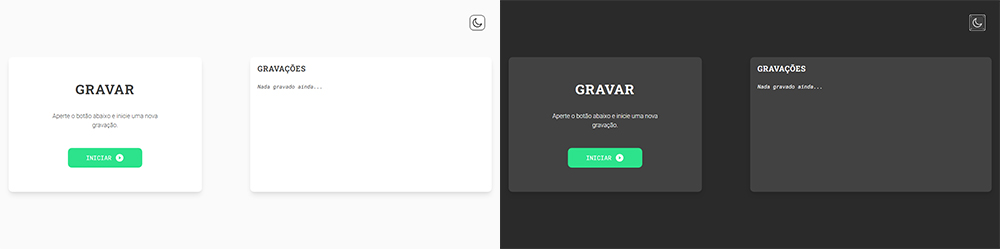

<h1 align="center">
	Voice Recorder
</h1>

<p align="center">
	Record voice notes on client side.
</p>

<p align="center">
 	
	
</p>

<p align="center">
	
</p>

# Table of Content

<p align="center">
 <a href="#-technologies">Technologies</a> •
 <a href="#-how-to-use">How To Use</a>
</p>

### 🤖 Technologies

- [MediaRecorder Web API](https://developer.mozilla.org/en-US/docs/Web/API/MediaRecorder)
- [ReactJS](https://reactjs.org/)
- [Tailwind CSS](https://tailwindcss.com/)
- [slugify](https://www.npmjs.com/package/slugify)
- [VS Code](https://code.visualstudio.com/)

### 💡 How To Use

To clone and run this application, you'll need [Git](https://git-scm.com/), [Node.js v14.15.4](https://nodejs.org/en/) + [Yarn v1.22.10](https://yarnpkg.com/) installed on your computer. From your command line:

```bash
# Clone this repository
$ git clone https://github.com/luan11/voice-recorder.git

# Go into the repository
$ cd voice-recorder

# Install dependencies
$ yarn install

# Run
$ yarn start
```
